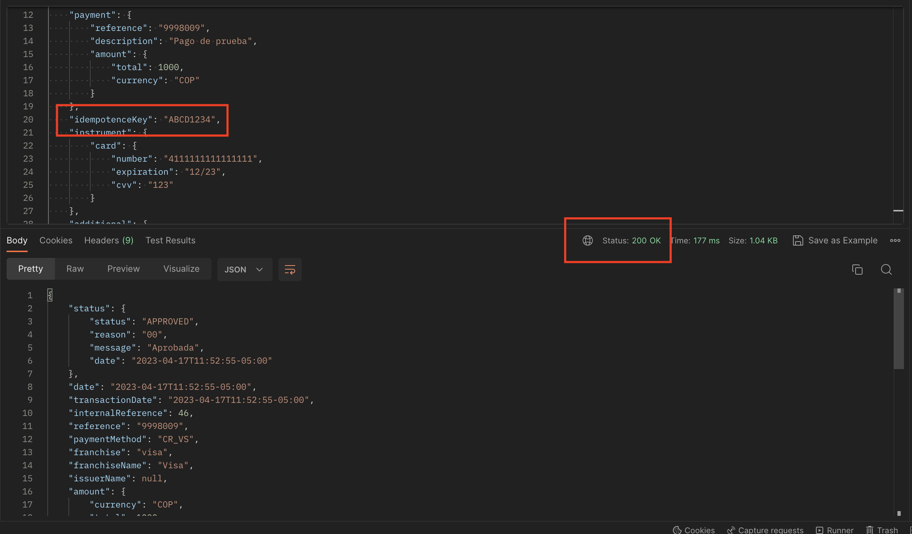
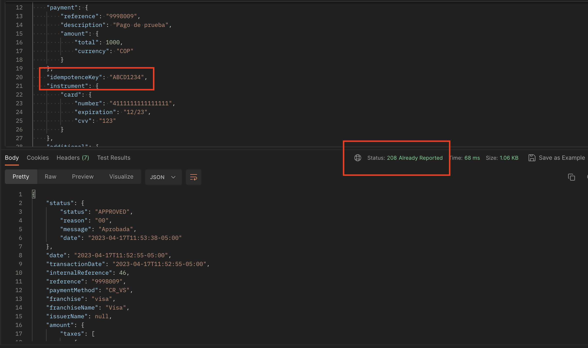

# Idempotence Control

Our Service can help you control to not generate an approved transaction for a unique process during a predetermine period. This is achieved by identifying the with a Unique Value that will be send out within the parameter of the IdempotenceKey. This parameter will make sure that a transaction will not be processed again if there is already a transaction previously executed with a status of “Pending” or “Approved” with the same Unique Value in the predetermine period.

The Unique Value Will depend on the payment’s process flow executed by the user and the way the merchant’s purchase process works. The merchant must define the Unique Value by considering different parameter necessary to take advantage and utilize the IdempotenceKey functionality offer by the service.

For example: Client A will pay for Service X. The client already has an account number with this merchant; thus, this parameter should be contemplated within the generation of the Unique Value of the transaction that will be executed in function of the specific service that is being paid in that moment for that same client account number.

<!-- theme: info -->
> It is imperative and the merchant’s responsibility to define the Unique Value as necessary according to the business logic of use case of the merchant. If all the necessary parameters that make a transaction unique are not consider or included within the generation of the Unique Value, then there could be duplicate transactions. This could occur for different reasons (same value is not send or not able to generate new transactions that should be executed).

```
{
    ...
    "idempotenceKey": "ABCD1234",
    "instrument": {
    ...
}
```

## Basic flow

The first transaction is done with the IdempotenceKey and the response could be a Approve Transaction or Pending Transaction



The transaction is requested again with the same value and the response returns is the same as last time, but with an HTTP Code 208 instead of 200.




## Observation

* The parameter is found within the root of the authorization’s request and is a alphanumeric of 32 digits
* It is the only Unquie Value that affect this behavior. This means that the reference, amount, and instrument may vary of differ but if the IdempotenceKey is the same, then a new transaction will not be executed.

<!-- theme: info -->
> This Service does not pretend and should not be taken as a change to the integration process flow [flujo de integración](Flujo-de-integracion.md) specifically step #4; this is an additional control that could be interpreted.